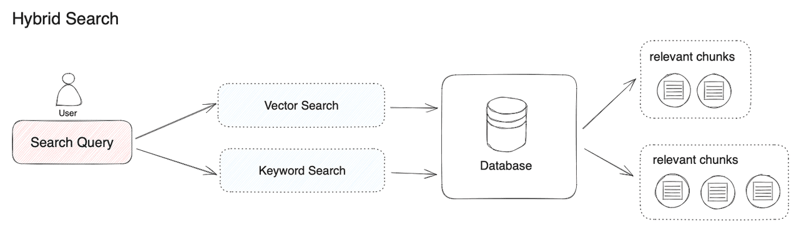

# Hybrid RAG: Combining Keyword Search and Vector Search

## Overview
This project implements a **Retrieval-Augmented Generation (RAG)** approach that combines two retrieval techniques: **Keyword Search** and **Vector Search**.

 

 

- **Keyword Search (Sparse Retriever)**: This is a traditional method where a search query is matched with exact or closely related terms in a document collection using a keyword-based approach.
- **Vector Search (Dense Retriever)**: This method uses semantic meaning to retrieve relevant documents, ensuring that even if the query words don’t match exactly, the system can still return relevant results.

For more details on hybrid search, refer to this article:  
[Hybrid Search: Combining BM25 and Semantic Search](https://medium.com/etoai/hybrid-search-combining-bm25-and-semantic-search-for-better-results-with-lan-1358038fe7e6)

---

## Technology Stack
The project leverages the following tools and models:

- **Groq**: Selects the LLM model for text generation.
- **LangChain**: A framework for developing RAG-based applications.
- **Hugging Face**: Provides pre-trained models for embedding.
- **ChromaDB**: A vector database for storing and retrieving vectorized data.
- **BM25**: A ranking algorithm used in information retrieval systems to estimate the relevance of documents to a given search query.

---

## Features
The system includes three main functionalities:

1. **Upload Data**  
   - Supports uploading PDF documents as external knowledge sources for the chatbot.

2. **Hybrid Search**  
   - Performs **Keyword Search** and **Vector Search** on the query and ensembles the results.

3. **Response Generation**  
   - Generates responses based on the retrieved data from the hybrid search.

---

## Approach: Dense Retriever & Sparse Retriever
1. Insert external data into the vector database.
2. When a query is received, perform **Hybrid Search** (combining keyword-based and semantic search).
3. Ensemble the results from both retrieval methods.
4. Use the retrieved data to generate an accurate and relevant response.

---

## Result
- The chatbot can answer queries using a **Hybrid Search** approach.
- The responses are **more relevant** and **better aligned** with the query.